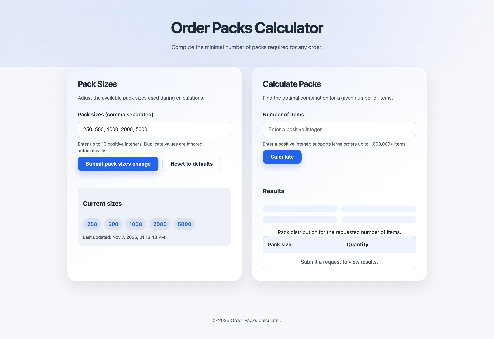

# Order Packs Calculator

Order Packs Calculator is a Go web service plus lightweight UI that determines the minimum number of packs needed to fulfil an order for a given number of items. Operators can update available pack sizes on the fly and immediately run calculations, including the benchmark edge case of `[23, 31, 53] → 500 000 items`.




## Features

- Dynamic-programming calculator that guarantees the minimal number of packs or explains why it is impossible.
- Pack size management with validation (≤10 positive sizes) exposed via the REST API and UI.
- Responsive frontend (vanilla HTML/CSS/JS) that mirrors API capabilities.
- In-memory storage abstraction ready for alternative backends.
- Structured JSON logging (zap), panic recovery, request IDs, and CORS preflight support.
- Token-bucket rate limiting to blunt accidental or malicious request bursts.
- Containerised deployment via multi-stage Dockerfile and Compose.

**Tech stack:** Go ≥ 1.25.1, standard library net/http, HTML/CSS/JavaScript, Docker, Docker Compose.

## Architecture Overview

```
cmd/server/main.go         # bootstrap, config, HTTP server
internal/calculator        # DP coin-change style algorithm
internal/storage           # pack-size storage abstraction + in-memory impl
internal/api               # handlers, router, middleware
internal/config            # multi-source configuration loader (YAML, env, CLI)
web/                       # static UI assets
docs/                      # supplementary documentation (api.md, algorithm.md, etc.)
```

## Quick Start

### Docker Compose (recommended)

```bash
docker compose up --build
# open http://localhost:8080
```

### Local Development

Requirements: Go ≥ 1.25.1, Node not required.

```bash
# run API + UI locally
make run

# install development tooling into ./bin (golangci-lint download via install.sh)
make tools

# run unit tests
make test

# lint (requires prior make tools)
make lint

# format / tidy
make fmt
make tidy
```

The server listens on `http://localhost:8080`, serving both the API under `/api/*` and the UI under `/`.

## Configuration

The application supports multiple configuration sources with the following precedence order (highest to lowest):
1. **CLI flags** – Command-line arguments override all other sources
2. **YAML config file** – Structured configuration file
3. **Environment variables** – Traditional environment-based configuration
4. **Defaults** – Built-in default values

### YAML Configuration File

You can use a YAML configuration file for structured configuration. Copy `config.yaml.example` to `config.yaml` and customize as needed:

```bash
cp config.yaml.example config.yaml
# Edit config.yaml with your settings
```

Example `config.yaml`:

```yaml
port: "8080"
pack_sizes:
  - 250
  - 500
  - 1000
  - 2000
  - 5000
shutdown_grace_period: "10s"
read_header_timeout: "5s"
write_timeout: "15s"
idle_timeout: "60s"
enable_request_logging: true
rate_limit:
  rps: 25.0
  burst: 50
```

### Command-Line Flags

The application supports the following CLI flags:

| Flag | Description | Example |
|------|-------------|---------|
| `--config` | Path to YAML configuration file | `--config=/path/to/config.yaml` |
| `--port` | HTTP port exposed by the service | `--port=9090` |
| `--pack-sizes` | Comma-separated initial pack sizes | `--pack-sizes=100,200,300` |
| `--rate-limit-rps` | Requests per second allowed (set `0` to disable) | `--rate-limit-rps=50` |
| `--rate-limit-burst` | Burst capacity for rate limiter (set `0` to disable) | `--rate-limit-burst=100` |

Example usage:

```bash
# Use YAML config with CLI overrides
./pack-calculator --config=config.yaml --port=9090

# Use only CLI flags
./pack-calculator --port=9090 --pack-sizes=100,200,300

# Use environment variables (backward compatible)
PORT=9090 PACK_SIZES=100,200,300 ./pack-calculator
```

### Environment Variables

For backward compatibility, environment variables are still supported:

| Variable | Default | Description |
|----------|---------|-------------|
| `PORT` | `8080` | HTTP port exposed by the service |
| `PACK_SIZES` | `250,500,1000,2000,5000` | Comma-separated initial pack sizes |
| `RATE_LIMIT_RPS` | `25` | Requests per second allowed (set `0` to disable) |
| `RATE_LIMIT_BURST` | `50` | Burst capacity for the rate limiter (set `0` to disable) |

**Note:** Environment variables override YAML config but are overridden by CLI flags.

## Testing & Quality

```bash
# run unit + handler tests
make test

# include race detector / coverage
make test-race
make coverage

# run benchmarks if you tweak the algorithm
make bench
```

- Critical DP logic validated via table-driven tests covering coprime, impossible, and large-number scenarios.
- API handler tests exercise validation, CORS preflight, request IDs, and the 500 000-item edge case.
- Docker image exposes `/api/health` used by the container healthcheck.

## API Summary

See `docs/api.md` for full schemas and examples.

| Method | Path             | Description                         |
|--------|------------------|-------------------------------------|
| GET    | `/api/health`    | Service heartbeat.                  |
| GET    | `/api/pack-sizes`| Current pack sizes + updated time.  |
| PUT    | `/api/pack-sizes`| Update pack sizes (1–10 positive ints). |
| POST   | `/api/calculate` | Calculate minimal packs for `items` (positive integer). |

`POST /api/calculate` rejects zero or negative `items` values with `400 Bad Request`.

### Error Handling

Errors are JSON with `error` + `details`. Validation failures return `400`, impossible calculations return `422`, unexpected issues return `500`.

## Algorithm Summary

The calculator solves a bounded coin-change variant with dynamic programming:

- Pack sizes are normalised (unique, sorted) and used to build a DP table up to the requested item count.
- Reconstruction walks backwards to count packs per size.
- Complexity: `O(items × |packSizes|)` time and `O(items)` memory.
- Impossible combinations trigger `ErrCannotFulfill`.

More detail, including the `[23, 31, 53] → 500 000` walkthrough, lives in `docs/algorithm.md`.

## Deployment

- **Docker:** `docker compose up --build` runs the service as a non-root user on Alpine with a baked-in healthcheck.
- **Kubernetes / other schedulers:** reuse the Docker image and configure the same env vars plus readiness checks hitting `/api/health`.

## Additional Resources

- `docs/api.md` – request/response contracts.
- `docs/algorithm.md` – DP explanation, complexity, examples.
*** End Patch*** End Patch
